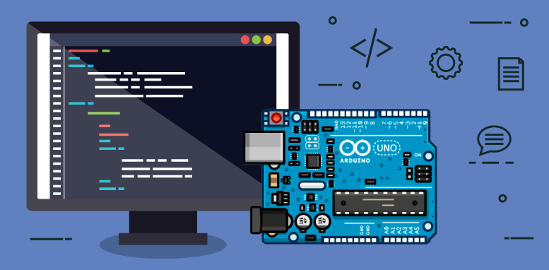

<!--  
    Ruan Pezzin Miniguite
    V. 2.1 
-->

<!-- ============== HEADER ============== -->
<div align="center" id="header">

  <a href="https://www.arduino.cc/">
    
  </a>
  <h3 align="center">Projects Arduino</h3>
</div>


<!-- ===== SUMARIO ===== -->
<details>
  <summary>Table of Contents</summary>
  <ol>
    <li><a href="#about-the-project">About The Project</a></li>
    <li><a href="#license">License</a></li>
    <li><a href="#author">Author</a></li>
  </ol>
</details>

---


<!-- ============== SHIELDS ============== -->
<div align="center">

  ![GitHub repo size][GitHub repo size-shields]
  ![GitHub language count][GitHub language count-shields]
  ![GitHub forks][GitHub forks-shields]
  [![GitHub License][GitHub License-shields]][GitHub License-link]
  [![Website][Website-shields]][Website-link]

</div>


<!-- ============== ABOUT ============== -->
## About the project

<div align="center">
  
<br><br>
</div>

<h4>List Projects</h4>

- [Calculadora](https://github.com/RuanMiniguite/Projects-Arduino/tree/main/Calculadoral)
- [Porta com senha](https://github.com/RuanMiniguite/Projects-Arduino/tree/main/Porta%20com%20senha)
- [Potenciômetro Controlador de consumo](https://github.com/RuanMiniguite/Projects-Arduino/tree/main/Potenciometro%20Controlador%20de%20consumo)
- [Potenciômetro Digital](https://github.com/RuanMiniguite/Projects-Arduino/tree/main/Potenciometro%20digital)
- [Semáforo](https://github.com/RuanMiniguite/Projects-Arduino/tree/main/Semaforo)

<br>

```
Git Clone https://github.com/RuanMiniguite/Projects-Arduino.git
```

<!-- ============== LICENSE ============== -->
## License

Distributed under the MIT License. See `LICENSE.txt` for more information.


<!-- ============== AUTHOR ============== -->
## Author

[<br><sub>@RuanMiniguite</sub>](https://github.com/RuanMiniguite)


<p align="right">(<a href="#header">back to top</a>)</p>


<!-- ============== LINKs ============== -->
<!-- Alterar link -->
[Site-link]: https://github.com/RuanMiniguite/Projects-Arduino
[GitHub License-link]: https://github.com/RuanMiniguite/Projects-Arduino/blob/6e2a2be0390b0d686f5f3d1eeb314f2b94c00afe/LICENSE


<!-- Alterar caminho para repositorio [Template-Readme] -->
[GitHub repo size-shields]: https://img.shields.io/github/repo-size/RuanMiniguite/Projects-Arduino?style=for-the-badge
[GitHub language count-shields]: https://img.shields.io/github/languages/count/RuanMiniguite/Projects-Arduino?style=for-the-badge
[GitHub forks-shields]: https://img.shields.io/github/forks/RuanMiniguite/Projects-Arduino?style=for-the-badge


[GitHub License-shields]: https://img.shields.io/cocoapods/l/m?down_color=292929&up_color=292929&style=for-the-badge
[Site-shields]: https://img.shields.io/badge/Site-Live-292929?style=for-the-badge&logo=web&logoColor=white
[Website-link]: https://github.com/RuanMiniguite/Commit-Message
[Website-shields]: https://img.shields.io/website?down_color=292929&down_message=404&style=for-the-badge&logo=github&up_color=292929&up_message=Commit&url=https%3A%2F%2Fgithub.com%2FRuanMiniguite%2FCommit-Message